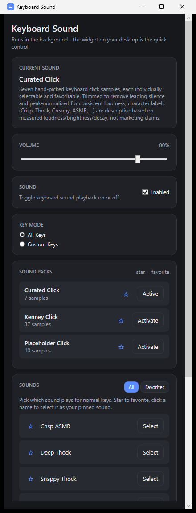

# Keyboard Sound

[](https://github.com/hugoschmidtparchim-sudo/keyboard-sound)
[](https://github.com/hugoschmidtparchim-sudo/keyboard-sound/actions/workflows/build.yml)
[](LICENSE)

[](https://github.com/topics/windows) [](https://github.com/topics/wpf) [](https://github.com/topics/dotnet) [](https://github.com/topics/csharp) [](https://github.com/topics/keyboard) [](https://github.com/topics/audio) [](https://github.com/topics/mechanical-keyboard) [](https://github.com/topics/desktop-app) [](https://github.com/topics/system-tray) [](https://github.com/topics/naudio)

A lightweight Windows background app that plays keyboard-click sounds on real key presses,
system-wide, controlled through a small draggable desktop widget. See
[docs/ARCHITECTURE.md](docs/ARCHITECTURE.md) for the technology decision and module map.



## Requirements

- Windows 10/11
- [.NET 8 SDK](https://dotnet.microsoft.com/download/dotnet/8.0) (for building/running from source)

## Run from source

```powershell
dotnet run --project src\KeyboardSound.App
```

## Run tests

```powershell
dotnet test src\KeyboardSound.Tests
```

## Production build (self-contained, single .exe)

```powershell
dotnet publish src\KeyboardSound.App -c Release -r win-x64 --self-contained true -p:PublishSingleFile=true -p:IncludeNativeLibrariesForSelfExtract=true -o publish\win-x64
```

The result, `publish\win-x64\KeyboardSound.exe`, runs standalone without a .NET install on the
target machine.

## Soundpacks

`assets\soundpacks\CuratedClick\` is the default pack: 7 hand-picked real click samples
(Crisp ASMR, Deep Thock, Soft Creamy, Snappy Thock, Whisper Soft, Warm Creamy, Ultra Crisp),
each individually favoritable and selectable in the main window's SOUNDS section - see
[docs/ARCHITECTURE.md](docs/ARCHITECTURE.md#individual-sounds-and-stable-ids) for how stable
sound ids work. `assets\soundpacks\KenneyClick\` is a second real pack (CC0-licensed
click/interface samples from Kenney's "Interface Sounds" pack, kenney.nl). `assets\soundpacks\Placeholder\`
is a synthetic fallback pack (no external assets, no licensing to track) kept around for quick
local testing; regenerate it with:

```powershell
powershell -ExecutionPolicy Bypass -File tools\generate-placeholder-sounds.ps1
```

Add a real recorded soundpack later by dropping a new folder with the same `pack.json` +
category-folder structure into `assets\soundpacks\` (or the user soundpacks directory under
`%LOCALAPPDATA%\KeyboardSound\Soundpacks`) - nothing in the app hardcodes pack names.
Samples may be `.wav` or `.ogg`. Give individual samples curated, permanent ids/display names
via pack.json's optional `"sounds"` array (see ARCHITECTURE.md); otherwise ids are auto-derived
from the file name.

**Note:** soundpack files are copied into the build output at build time - after editing
anything under `assets\soundpacks\`, run `dotnet build` before relaunching, or the app will
run against a stale copy.

### Third-party assets

`assets\soundpacks\KenneyClick\` contains audio samples from Kenney's "Interface Sounds" pack
(https://kenney.nl/assets/interface-sounds), licensed CC0 (public domain) - free for personal,
educational and commercial use, attribution appreciated but not required. The original
`License.txt` is kept alongside the samples for provenance.
